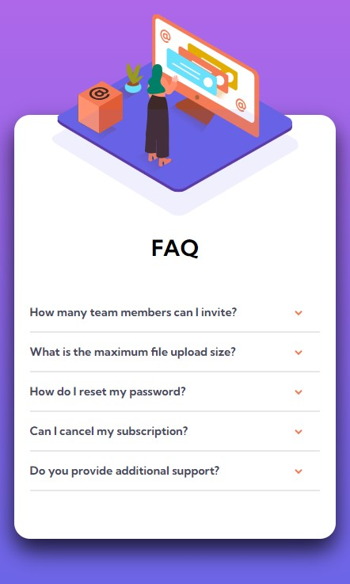

# Frontend Mentor - FAQ accordion card solution

This is a solution to the [FAQ accordion card challenge on Frontend Mentor](https://www.frontendmentor.io/challenges/faq-accordion-card-XlyjD0Oam). 
## Table of contents

- [Overview](#overview)
  - [Screenshot](#screenshot)
  - [Links](#links)
- [My process](#my-process)
  - [Built with](#built-with)
- [Author](#author)

## Overview

### Screenshot

### Links

- Solution URL: [Github](https://github.com/Muhammad-Taus/Front-End-Mentor-FAQ-Accordion-Card)
- Live Site URL: [Live site URL](https://mt-fem-faq-accordion-card.netlify.app/)

## My process

### Built with

- Semantic HTML5 markup
- CSS custom properties
- Flexbox
- Desktop-first workflow
- CSS position properties

## Author

- Frontend Mentor - [@Muhammad-Taus](https://www.frontendmentor.io/profile/Muhammad-Taus)

